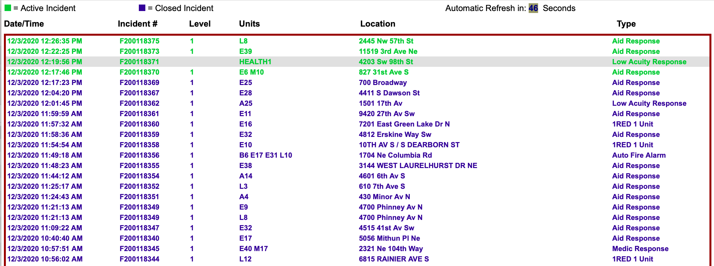
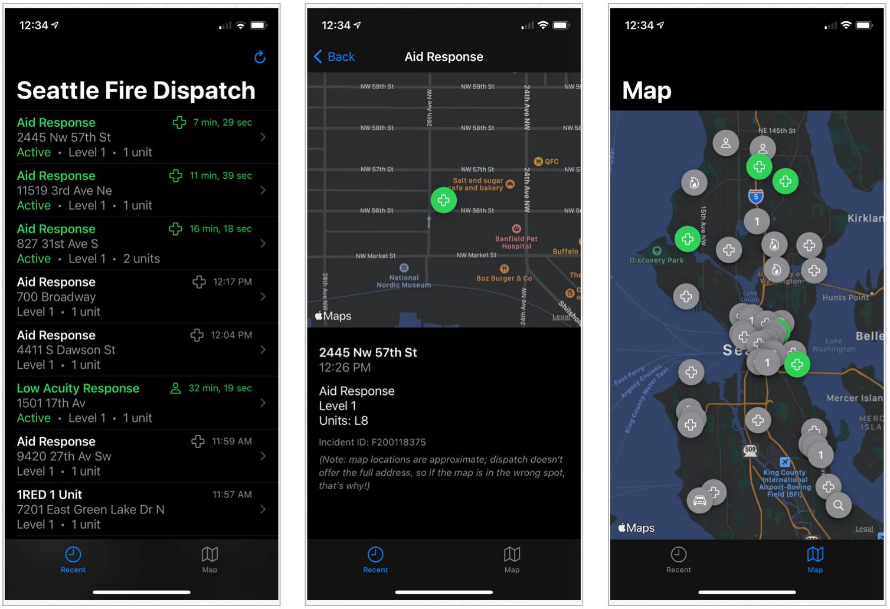

# Seattle-Fire-Dispatch
A little SwiftUI app that shows Seattle's Fire Dispatch data in an easier-to-read display.

Sometimes, there is a fire engine in the distance, or lots of them - and you want to know what's going on.

Seattle's fire department has a [nice little website here](http://www2.seattle.gov/fire/realtime911/getRecsForDatePub.asp?action=Today&incDate=&rad1=des) that shows all the recent fire-dispatch data for the city:

The problem is that it's in a list that's not mobile-friendly - so I made this little iOS app, which displays the dispatch in a list view, and a map view - and it supports dark mode, too, which is nice when it's the middle of the night and you hear lots of sirens.

## Under the hood
 - This uses [Fuzi](https://github.com/cezheng/Fuzi) to scrape the data out of the HTML of the website
 - Uses MapKit to geocode the addresses into points on the map
 - Uses SwiftUI to render everything
 
 It's not a perfect app - I just made it to play around with SwiftUI. Stuff that'd be nice to do:
  - Reorganize the ListView and pull types and network-fetching code out into its own file
  - Fixup the Map tab so that it prioritizes "active" cases in a better way.
  - Probably a bunch of other things, too!
